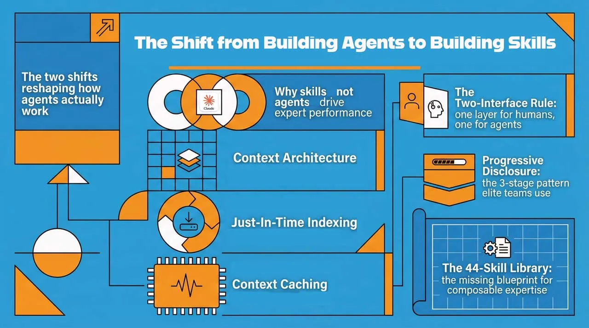

AI Agent Skills Workforce Platform
Claude Agent Skills (Anthropic, Oct 2025) — composable, progressive-disclosure skill directories that replace monolithic agents. This is not a generic "AI has skills" project. See the Anthropic Engineering Blog for the open standard.

Architecture Overview
User request → Orchestrator (port 8000)
                    │
                    ▼
       Claude reads SKILL.md descriptions only
       (progressive disclosure — lightweight routing)
                    │
          ┌─────────┼──────────┬──────────┬──────────┐
          ▼         ▼          ▼          ▼          ▼
       Nova       Axiom    Sentinel    Nexus    Prometheus
    (AKS/ACR)  (Databricks) (Tests)   (Docs)   (FinOps)
     :8001       :8002       :8003     :8004      :8005
Claude loads the full skill body only when routed to that skill — keeping context windows lean and costs low. This is the core advantage of Claude Agent Skills over monolithic agents.

Claude Agent Skill Standard
Each skill follows the Anthropic open standard:
skills/<name>/
├── SKILL.md          ← YAML frontmatter: name + description (always loaded)
├── workflows/        ← Sub-task instructions (loaded on demand)
├── scripts/          ← FastAPI microservice code
└── resources/        ← Templates, configs, static assets
Each SKILL.md starts with a YAML frontmatter block containing name and description. The description is what Claude reads at routing time — be specific, because this determines whether the skill gets selected. The full skill instructions follow below the frontmatter.

Skill Reference
SkillPortAzure ServicesDatabricksNova8001AKS, ACR, APIM, Monitor, Key Vault, Blob, Service BusMLflow trackingAxiom8002Blob Storage, Service BusDelta Lake, MLflow, SparkSentinel8003Azure DevOps, Blob, MonitorMLflow artefactsNexus8004APIM Developer Portal, Blob—Prometheus8005Monitor, App Config, BlobMLflow experiments

Environment Setup
Copy the example env file and fill in your Azure and Anthropic credentials:
bashcp config/.env.example config/.env
See config/.env.example for the full annotated list of required variables.

Running Locally
bashpip install -r requirements.txt
python deployment/launch_ui.py
All 5 skills and the orchestrator start automatically. On Windows, double-click deployment/START_UI.bat instead. The browser opens at docs/index.html showing live health status for all services.

Deploying to Azure AKS
Use the Nova skill itself to deploy the other skills — dogfooding the platform:
bashcurl -X POST http://localhost:8000/task \
  -H "Content-Type: application/json" \
  -d '{"task": "deploy axiom data pipeline service to AKS"}'
Nova reads its workflows/Deploy.md, executes the 11-step Azure deployment, and returns the live endpoint.

---

## 📄 Documentation

View the full styled documentation site:
**[https://quantumai101.github.io/ai-agent-skills-workforce-platform/docs/README.md.html](https://quantumai101.github.io/ai-agent-skills-workforce-platform/docs/README.md.html)**

GitHub: quantumai101/ai-agent-skills-workforce-platform

